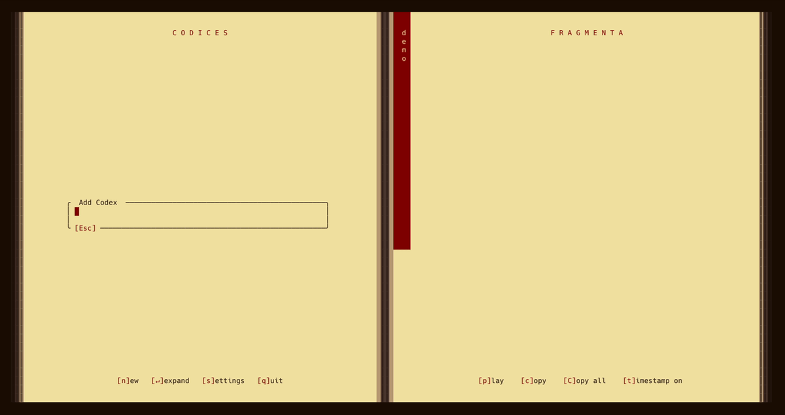

# Scriptor

[](LICENSE)

Scriptor is a fully local, real-time speech-to-text tool. You speak into your microphone, and it transcribes what you say as you say it. No cloud calls, no API tokens, no privacy concerns. The name comes from the Latin word for scribe: someone who copies and records.

## Table of Contents

- [What Scriptor Looks Like](#what-scriptor-looks-like)
- [What It Does](#what-it-does)
- [The Medieval Scribe Aesthetic](#the-medieval-scribe-aesthetic)
- [Installation](#installation)
- [Usage](#usage)
- [Key Bindings](#key-bindings)
- [Configuration](#configuration)
- [Data Storage](#data-storage)

## What Scriptor Looks Like



## What It Does

Scriptor has two distinct interfaces. Run it with no arguments and you get the TUI. Pass a command and you get the CLI.

**CLI** — Quick, throwaway transcription. You speak, it dumps the transcription to stdout. Nothing gets saved unless you explicitly ask for it: not the text, not the audio. Useful when you just want to capture something fast without any persistence.

**TUI** — A persistence layer for accumulating and organizing knowledge over time. Built for those moments when you've spent months on a project and have a ton of context in your head, but sitting down to write it all out would take forever. With Scriptor's TUI, you just talk. Everything gets captured, organized by project and date, stored in a local SQLite database, and available for playback later.

Under the hood: Rust, NVIDIA Parakeet (ONNX) for speech-to-text, Silero VAD for splitting audio at natural pause points. Models are downloaded automatically on first run.

## The Medieval Scribe Aesthetic

Since this is a tool about capturing spoken knowledge, the naming reflects a medieval monk transcribing in a scriptorium:

- **Codex** — A project
- **Folio** — An audio recording
- **Fragmentum** — A small chunk of transcribed audio
- **Archivum** — The database, the archive of everything

## Installation

Install Scriptor using Cargo:

```
cargo install scriptor
```

## Usage

Run the TUI (default):

```bash
scriptor
```

Use the CLI for quick transcription tasks:

```bash
scriptor from-file recording.wav
scriptor record
scriptor record -t output.txt -a ./recordings
scriptor play ./recordings
```

Add `help`, `-h`, or `--help` to any subcommand for usage details:

```
$ scriptor help
Local speech-to-text CLI & TUI

Usage: scriptor [COMMAND]

Commands:
  from-file  Transcribe an existing WAV
  record      Record & transcribe on the fly
  play        Playback a .wav file or a directory of .wav files
  help        Print this message or the help of the given subcommand(s)

Options:
  -h, --help     Print help
  -V, --version  Print version
```

### CLI Options

| Command | Options | Description |
|---------|---------|-------------|
| `from-file <file>` | — | Transcribe an existing .wav file to stdout |
| `record` | `-t <file>` | Save transcription to a .txt file |
| `record` | `-a <dir>` | Save audio recordings to a directory |
| `play <input>` | — | Play a .wav file or directory of .wav files |

## Key Bindings

### Main Screen

#### Navigation
| Key | Action |
|-----|--------|
| `↑` / `↓` | Move up/down in codices, folia, or fragmenta |
| `Enter` | Expand or collapse codex |
| `←` / `→` | Move between regions (codices ↔ fragmenta) |
| `Ctrl+↑` / `Ctrl+↓` | Reorder codex or folio |

#### Actions
| Key | Action |
|-----|--------|
| `n` | New codex |
| `i` | Import folio (add recording from file) |
| `a` | Change archivum |
| `m` | Modify selected codex or folio |
| `d` | Delete selected codex or folio |
| `r` | Record (creates new folio) |
| `e` | Extend recording (append to selected folio) |
| `p` | Play fragmenta from selected fragmentum (select fragmentum first) |
| `c` | Copy selected fragmentum to clipboard |
| `C` | Copy all fragmenta from selected folio to clipboard |
| `t` | Toggle timestamp display on fragmenta |
| `s` | Settings |
| `q` | Quit |

### Input Popups (Add/Modify Codex, Folio, Archivum)
| Key | Action |
|-----|--------|
| `Enter` | Save |
| `Esc` | Cancel |
| `Ctrl+a` | Jump to start of line |
| `Ctrl+e` | Jump to end of line |

### Archivum Selector
| Key | Action |
|-----|--------|
| `↑` / `↓` | Navigate archivum list |
| `Enter` | Switch to selected archivum |
| `a` | Add new archivum |
| `m` | Modify selected archivum |
| `d` | Delete selected archivum |
| `s` | Set selected archivum as default |
| `Esc` | Return to main screen |

### Settings
| Key | Action |
|-----|--------|
| `d` | Discard changes and exit |
| `s` | Save to current session only |
| `S` | Save as default (write to config file) |
| `↑` / `↓` | Previous/next field |
| `←` / `→` | Decrease/increase value |
| `Esc` | Return to main screen |

### Recording
| Key | Action |
|-----|--------|
| `Space` | Pause or resume recording |
| `Esc` | Stop recording and return to main screen |

## Configuration

Scriptor uses a TOML configuration file. It is created automatically on first run. Location:

- **Linux**: `~/.config/scriptor/scriptor.toml`
- **macOS**: `~/Library/Application Support/scriptor/scriptor.toml`
- **Windows**: `%APPDATA%\scriptor\scriptor.toml`

You can configure the VAD silence threshold, min/max fragmentum duration, pause threshold, which STT and VAD models to use, the input device, and the colour theme.

## Data Storage

All data is stored locally:

- **Databases**: SQLite files in the data directory. Default location:
  - **Linux**: `~/.local/share/scriptor/databases/`
  - **macOS**: `~/Library/Application Support/scriptor/databases/`
  - **Windows**: `%LOCALAPPDATA%\scriptor\databases\`

- **Models**: STT and VAD models are stored in the data directory and downloaded automatically from CloudFront on first run. No manual setup, no Hugging Face tokens.

- **Configuration**: Stored in the config directory (see above). The configuration file and databases are created automatically when you first run the application.
